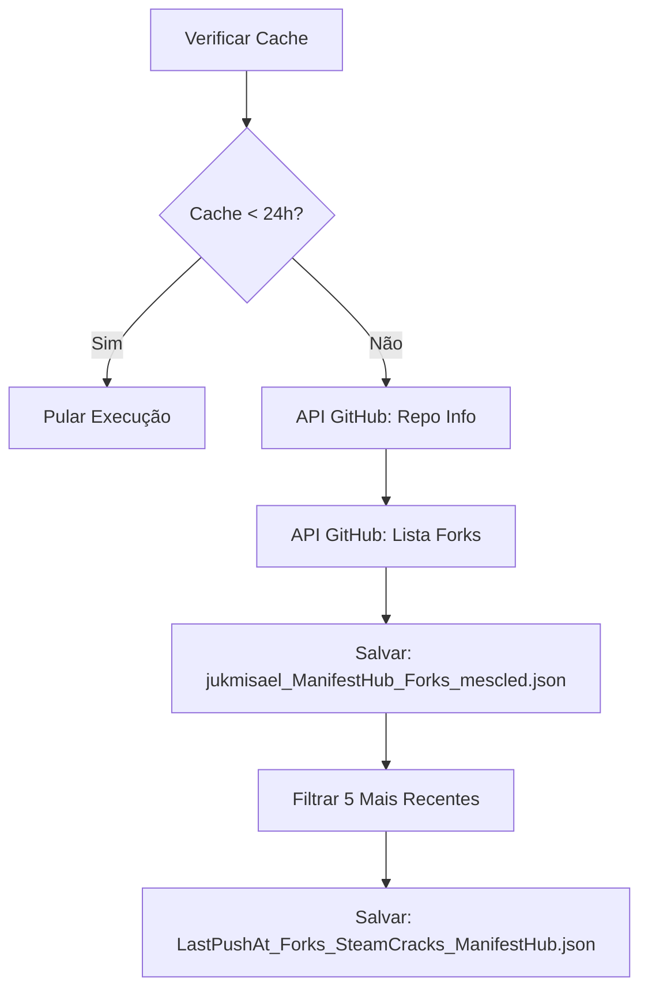
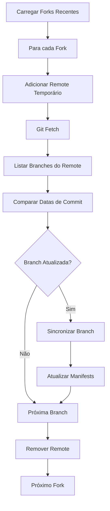
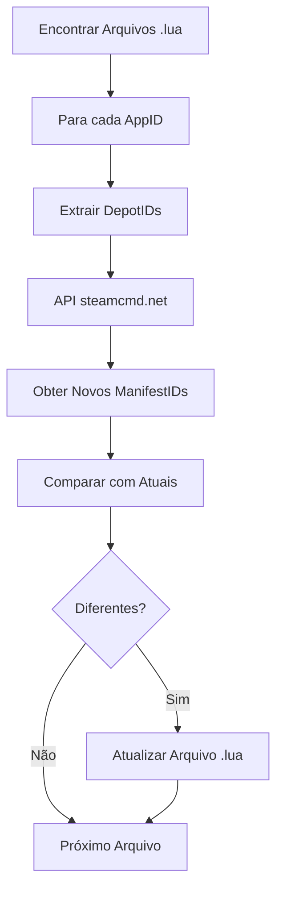

# Sistema de Automação ManifestHub

Sistema automatizado para monitoramento e sincronização de forks do repositório ManifestHub usando GitHub Actions.

## 📋 Visão Geral

Este sistema implementa um fluxo de trabalho automatizado que:

1. **Coleta dados de forks diariamente** - Monitora todos os forks do repositório
2. **Sincroniza branches atualizadas** - Identifica e sincroniza mudanças dos forks mais ativos
3. **Atualiza manifests automaticamente** - Usa a API do steamcmd.net para manter manifests atualizados
4. **Realiza manutenção do sistema** - Limpeza e otimização automática

## 🏗️ Arquitetura

### Workflows do GitHub Actions

#### 1. Daily Data Collection (`.github/workflows/daily-data-collection.yml`)
- **Frequência**: Diário às 06:00 UTC
- **Função**: Coleta dados de todos os forks e identifica os 5 mais recentes
- **Cache**: Pula execução se dados têm menos de 24 horas

#### 2. Sync Branches (`.github/workflows/sync-branches.yml`)
- **Frequência**: A cada 2 horas
- **Função**: Sincroniza branches dos forks mais ativos e atualiza manifests
- **Otimização**: Compara datas de commits para sincronizar apenas mudanças

#### 3. System Maintenance (`.github/workflows/maintenance.yml`)
- **Frequência**: Semanal aos domingos às 02:00 UTC
- **Função**: Limpeza de logs, validação de dados e otimização do repositório

### Scripts Python

#### Core Scripts
- `scripts/collect_forks_data.py` - Coleta dados de forks via API do GitHub
- `scripts/filter_recent_forks.py` - Filtra os 5 forks mais recentes
- `scripts/sync_branches.py` - Sincroniza branches dos forks ativos
- `scripts/update_manifests.py` - Atualiza manifests usando API do steamcmd.net
- `scripts/maintenance.py` - Manutenção e limpeza do sistema
- `scripts/utils.py` - Utilitários compartilhados

## 🚀 Como Funciona

### 1. Coleta de Dados (Diário)



### 2. Sincronização de Branches (A cada 2h)



### 3. Atualização de Manifests



## 📁 Estrutura de Arquivos

```
ManifestHub/
├── .github/workflows/          # Workflows do GitHub Actions
│   ├── daily-data-collection.yml
│   ├── sync-branches.yml
│   └── maintenance.yml
├── scripts/                    # Scripts Python
│   ├── collect_forks_data.py
│   ├── filter_recent_forks.py
│   ├── sync_branches.py
│   ├── update_manifests.py
│   ├── maintenance.py
│   └── utils.py
├── config/                     # Configurações
│   └── settings.json
├── data/                       # Dados de cache
│   ├── jukmisael_ManifestHub_Forks_mescled.json
│   ├── LastPushAt_Forks_SteamCracks_ManifestHub.json
│   └── updated_branches.log
├── logs/                       # Logs do sistema
└── [AppID].lua                 # Arquivos de manifest
```

## ⚙️ Configuração

### Variáveis de Ambiente Necessárias

- `GITHUB_TOKEN` - Token do GitHub com permissões de leitura/escrita no repositório

### Arquivo de Configuração (`config/settings.json`)

```json
{
  "github": {
    "repository": "jukmisael/ManifestHub",
    "max_forks_to_track": 5,
    "api_timeout": 30
  },
  "steamcmd": {
    "api_base_url": "https://api.steamcmd.net/v1/info",
    "request_timeout": 30,
    "max_retries": 3
  },
  "cache": {
    "forks_cache_hours": 24,
    "data_directory": "data"
  }
}
```

## 🔧 Execução Manual

### Executar Coleta de Dados
```bash
python scripts/collect_forks_data.py
python scripts/filter_recent_forks.py
```

### Executar Sincronização
```bash
python scripts/sync_branches.py
python scripts/update_manifests.py
```

### Executar Manutenção
```bash
python scripts/maintenance.py --cleanup-logs --validate-data --generate-report
```

## 📊 Monitoramento

### Logs
- Logs detalhados em `logs/manifest_sync.log`
- Log de branches atualizadas em `data/updated_branches.log`
- Relatórios de manutenção em `data/maintenance_report.json`

### Métricas Importantes
- **Taxa de atualização**: Quantas branches são sincronizadas por execução
- **Tempo de execução**: Duração dos workflows
- **Erros de API**: Falhas nas chamadas para GitHub ou steamcmd.net
- **Tamanho do repositório**: Crescimento do repositório ao longo do tempo

## 🛠️ Manutenção

### Limpeza Automática
- Logs antigos (>30 dias) são removidos automaticamente
- Arquivos temporários são limpos
- Remotes temporários do Git são removidos

### Validação de Dados
- Integridade dos arquivos JSON é verificada
- Estrutura dos arquivos .lua é validada
- Timestamps são adicionados quando ausentes

### Otimização
- Repositório Git é otimizado com `git gc`
- Arquivos antigos são compactados
- Cache é validado e renovado quando necessário

## 🚨 Troubleshooting

### Problemas Comuns

#### 1. Rate Limit do GitHub
- **Sintoma**: Erro 403 com mensagem de rate limit
- **Solução**: Sistema aguarda automaticamente o reset do rate limit

#### 2. Falha na API do steamcmd.net
- **Sintoma**: Manifests não são atualizados
- **Solução**: Sistema tenta novamente com backoff exponencial

#### 3. Conflitos de Git
- **Sintoma**: Falha ao sincronizar branches
- **Solução**: Sistema limpa remotes temporários e tenta novamente

#### 4. Arquivos de Cache Corrompidos
- **Sintoma**: Erro ao carregar dados JSON
- **Solução**: Sistema regenera cache na próxima execução

### Logs de Debug

Para debug detalhado, verifique:
1. Logs do GitHub Actions na aba "Actions" do repositório
2. Arquivo `logs/manifest_sync.log`
3. Saída dos comandos Git nos logs

## 🔄 Fluxo de Atualização

### Processo Completo
1. **06:00 UTC**: Coleta dados de forks (se cache expirado)
2. **A cada 2h**: Sincroniza branches e atualiza manifests
3. **Domingo 02:00 UTC**: Manutenção e limpeza

### Otimizações Implementadas
- **Cache inteligente**: Evita coletas desnecessárias
- **Comparação de datas**: Sincroniza apenas branches atualizadas
- **Priorização**: Processa forks mais ativos primeiro
- **Rate limiting**: Respeita limites das APIs
- **Retry logic**: Tenta novamente em caso de falhas temporárias

## 📈 Melhorias Futuras

- [ ] Notificações por Discord/Slack em caso de falhas
- [ ] Dashboard web para monitoramento
- [ ] Métricas mais detalhadas
- [ ] Paralelização da sincronização de forks
- [ ] Cache distribuído para múltiplos runners
- [ ] Integração com outras APIs de dados Steam

---

**Nota**: Este sistema foi projetado para ser robusto e auto-suficiente, minimizando a necessidade de intervenção manual.